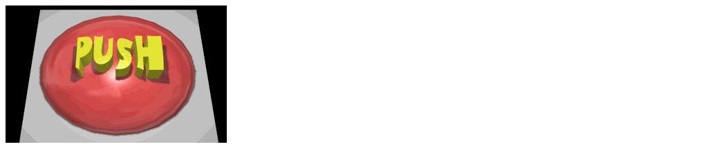

# Awesome Button examples

This is the file __test/appraise/examples/awesome_button.md__ where the component could have an alternative doc to Storybook's doc...

## Awesomeness "text-only"
### With short text (_Botoncito_)
~~~yaml example="Botoncito (short text)" fixture="url.js"
path: /rails/stories/button_component/with_short_text
~~~

## Anti-patterns "awesomeness" section

Please, note that **this examples should be avoided**. Pleaseeee!!! xDDD

### With a BIG image (_The Botonaco_ requirement)
~~~yaml example="Botonaco (with a BIG image)" fixture="url.js"
path: /rails/stories/button_component/with_long_text
~~~

## Botoncito (short text)

-326e5af7-7176-460e-bb82-dfc02b3ff315.png)

(generated: 29/1/2022 16:30:15)

## Botonaco (with a BIG image)

